# Google Sheets AI Vocabulary Builder

This project transforms a simple Google Sheet into a powerful, automated vocabulary learning tool. It uses Google Apps Script and the Gemini API to automatically fetch detailed information for any word you enter, and includes a suite of interactive tools like a spaced-repetition reviewer, a scramble puzzle, and a multiple-choice quiz to make learning effective and engaging.

## Features

- **Automated Word Lookup**: Simply type a word in Column A, and the script instantly populates the entire row with detailed information.
- **Rich Vocabulary Data**: Fetches parts of speech, multiple definitions, contextual examples, Persian translations, synonyms, antonyms, word families, and pronunciation, all powered by the Gemini API.
- **Spaced Repetition System (SRS)**: An interactive review panel shows you words that are due for review, helping you commit them to long-term memory.
- **Interactive Quizzes**: Test your knowledge with a multiple-choice quiz and an unscramble puzzle to make learning fun.
- **Automated Housekeeping**: Includes tools to sort your vocabulary list, format the sheet for readability, check for broken dictionary links, and remove duplicate entries.

---

## Files in This Project

1.  **`Code.gs`**: The main Google Apps Script file that acts as the backend. It handles all logic, including API calls, spreadsheet manipulation, and quiz data preparation.
2.  **`ReviewDialog.html`**: The frontend for the main Spaced Repetition System (SRS) review panel.
3.  **`QuizDialog.html`**: The frontend for the multiple-choice quiz.
4.  **`ScramblePuzzle.html`**: The frontend for the word scramble game.

---
## Version2(v2) Changelog

1. A new designed prompt
2. a new designed datastructure. Previously, you keep a single part of speech for each word. In the new design, all part of speechs will be received, saved, and displayed.
3. Adding a new column for the 'Persian Translation` of general examples.
4. add 3 new columns : Speaking, Writing, Difficulty. Now you can Mark a word for speaking or writing(or both), and also choose a difficulty level for each word. Later you can filter the words based on them!
5. Add auto pronunciation of word and **sentences**. For the sentences, you can select from different available voices from your browser and OS.
   1. **The word pronunciation might be corrupted for some words that have different pronunciation based on wether it is a noun, or verb, or ... . Since I had no way to sync the IPA phonetic with pronunciation(which came from another website), you might face some problems, seeing an IPA phonetic but hearing a different pronunciation. Appology in advance =)**  
6. Updates to HTML files to be compatible to the above changes.
---
## Migration from V1 to V2
**If you are new user, Move to the next section.**

If you have been using the V1 of this app and your sheet is not empty, you **MUST** follow the instructions below:
1. First, make a copy of your sheet as a backup.
2. Copy and paste the new files. Make sure to copy all of them(including `BatchUpdaterSidebar.html` file, which is new.). Make sure to replcae your `SHEET_NAME` and `YOUR_SPREED_SHEET_ID` in `code.gs` file.
3. Then, in the `Review Vocabulary` tab, press `SHIFT DATA for New Column` :
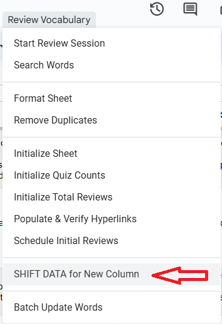
4. When this task is finished, Then you should update the entire dataset to the new format. Press `Batch Update Words` button in `Review Vocabulary` tab:
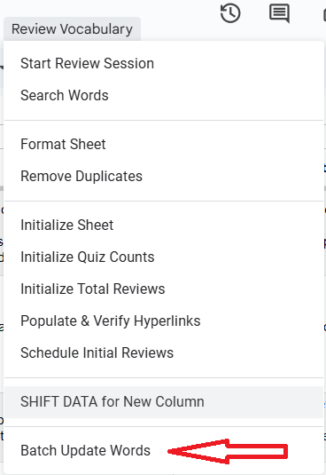
5. A new sidebar panel opens. On this panel you have the ability to manually update words in batches of size 9 (9 words at the same time) by pressing `Process Next Batch` (the green button), or automatically update all the words sequentially in batches of size 9 by pressing `Start Auto-process` (blue button)
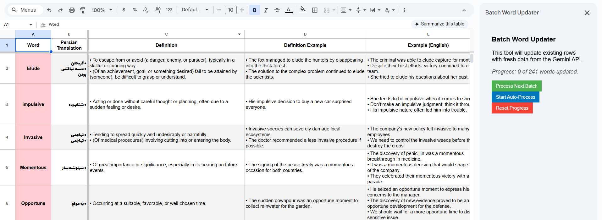
6. Let the process finish. At any moment, you can see how many words have been processed so far. Moreover, You have the ability to pause the process, and resume it later from the exact batch you have left from.
   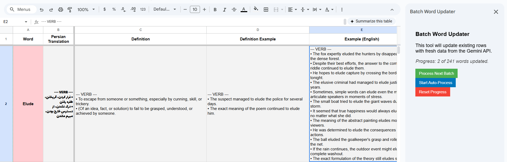
**Consider in mind that by updating the list, you will receive a completely new set of examples and definitions from Gemini 2.5 flash! All the previous definitions and examples will be updated. But, other columns (review date, review count, ...) are not touched.**
---

## Setup Guide for Non-Technical Users

Follow these steps carefully to get your own copy of the AI Vocabulary Builder up and running.

### Step 1: Create the Google Sheet
You have two options:
1. Option 1: 
   *  **Make a Copy**: Click this link to create your own copy of the template Google Sheet: [Vocabulary Sheet Template](https://docs.google.com/spreadsheets/d/1vU9DCcnKflJz85jhH7tsfZi6pZvHvScAWjzMmxNUveQ/copy)
   *  Click the **"Make a copy"** button. This will save a new spreadsheet to your personal Google Drive. You can rename it later if you wish.

2. Option 2:
  You can create a new spreedsheet in your google drive and upload the codes in this repo manually.(You can find further explanation in the next section.)


### Step 2: Add the Code to Your Sheet

1.  **Open Apps Script**: In your copied Google Sheet, go to the top menu and click **Extensions** > **Apps Script**.
    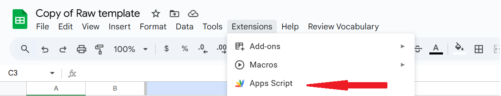

2.  **Add Code Files**:
    * You will see a window like this image:
    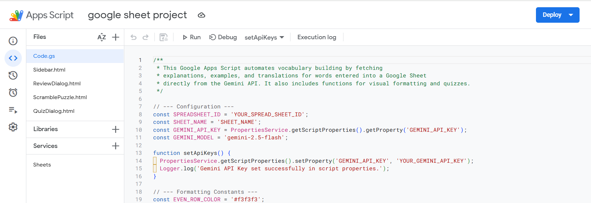
    **If you have not copied the template sheet, you have to create these .gs and .html files manually with the exact same names you see in the picture. Click the "+" sign on the top of the left panel for this. Create `Code.gs`, `ReviewDialog.html`, `QuizDialog.html`, `ScramblePuzzle.html`**. (You see a file named `Sidebar.html` in the picture. It's not important and you don't have to create this file.)

    * You will see a file named `Code.gs`. Delete all the content inside it and paste the entire contents of the `Code.gs` file from this project. (The content of this repository is up-to-date.)
    * Do the same for html files. Copy the latest version from this repo and paste it there.
3.  **Save All Files**: Click the **Save project** icon (it looks like a floppy disk) at the top of the editor.


### Step 3: Get Your Gemini API Key

To use the AI features, you need a special key from Google. This is free and easy to get.

1.  **Go to Google AI Studio**: Open this link in a new tab: [https://aistudio.google.com/app/apikey](https://aistudio.google.com/app/apikey)
2.  **Sign In**: If prompted, sign in with your Google account.
3.  **Create API Key**: Click the button that says **"Create API key"**.
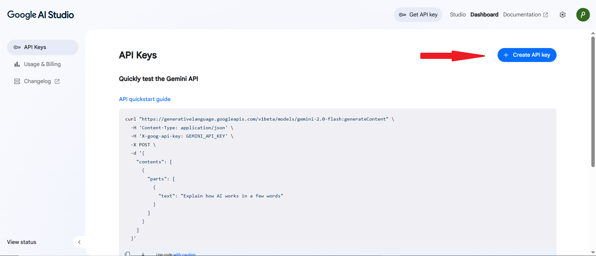

1.  **Copy Your Key**: A new key will be generated. It will be a long string of letters and numbers. Click the copy icon next to the key to copy it to your clipboard. **Keep this key safe and private.**

### Step 4: Set Your API Key and other variables

Now, you need to securely save the API key you copied in Step 3.

1.  **Find the `setApiKeys` function**: In the `Code.gs` file, you find the function named `setApiKeys`.
2.  **Paste Your Key**: Replace the text `YOUR_GEMINI_API_KEY` with the actual key you copied from Google AI Studio. The line should look like this:
    ```javascript
    scriptProperties.setProperty('GEMINI_API_KEY', 'AbCdEfGhIjKlMnOpQrStUvWxYz123456789'); // Your key will be here
    ```
    * 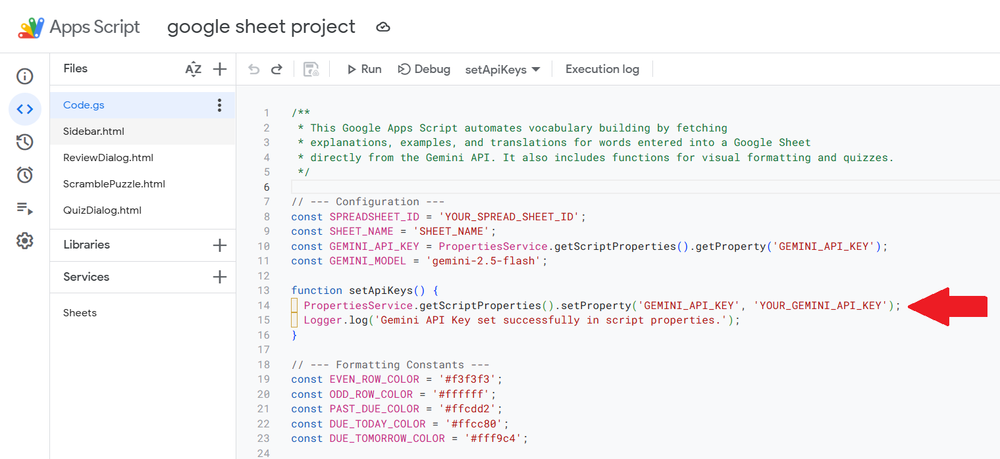
3.  **Run the Function**:
    * Make sure the `setApiKeys` function is selected from the dropdown menu at the top of the editor.
    
    * Click the **Run** button.
    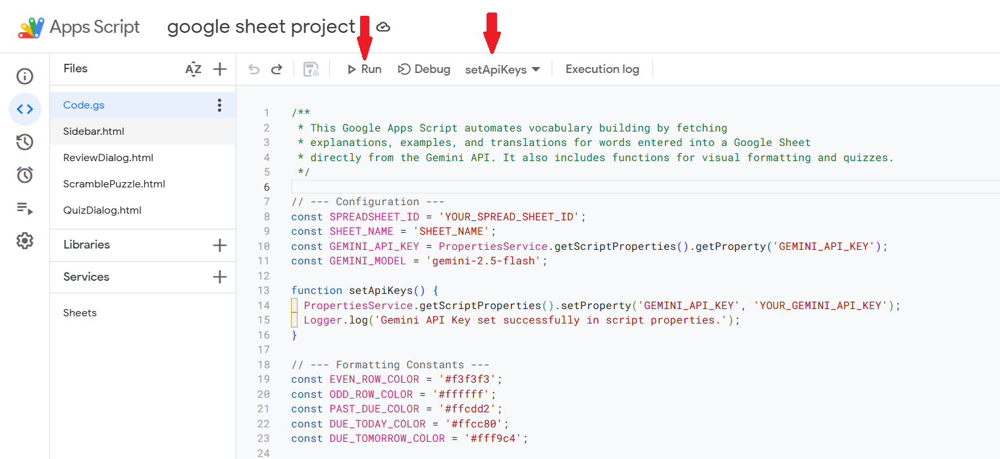
4.  **Authorize the Script**: A window will pop up asking for authorization.
    * Click **"Review permissions"**.
    * Choose your Google account.
    * You may see a "Google hasn’t verified this app" screen. This is normal. Click **"Advanced"**, then click **"Go to [Your Project Name] (unsafe)"**.
    * Click **"Allow"** on the final screen. (You must have billing information at google to verify your app to google. Since this is your private and personal sheet, it is completely safe to do the previous, unless you share your own sheet with others! Also you can verify the .gs and .html codes in this repository to make sure the app use your api key just for requesting Gemini.)
  

    * **You can also save your api key securely with another way. Click the gear icon on the left panel `Project Settings`. Scroll down until you see `Script Properties` section. Click on `Add script property` button, then create a key-value pair with key=`GEMINI_API_KEY` and the value will be your api key from google!**
5.  **Secure Your Key**: After the function runs successfully, it's a good security practice to delete your key from the code. You can either delete the entire line or just the key itself, like this:
    ```javascript
    scriptProperties.setProperty('GEMINI_API_KEY', 'YOUR_GEMINI_API_KEY'); // Key is now removed
    ```
6.  **Set other parameters**: On the left panel, return to the editor by clicking on `<>` icon. In the `Code.gs` file, find this lines of code :
```
// --- Configuration ---
const SPREADSHEET_ID = 'YOUR_SPREAD_SHEET_ID';
const SHEET_NAME = 'SHEET_NAME';
const GEMINI_API_KEY = PropertiesService.getScriptProperties().getProperty('GEMINI_API_KEY');
const GEMINI_MODEL = 'gemini-2.5-flash';
```

Your google sheet has an address like `https://docs.google.com/spreadsheets/d/1731c9TqkkMvmtt8AVZIts-ccPt276Fk8bZqkZY4AxNw/...` . This part is your spreedsheet id: `1731c9TqkkMvmtt8AVZIts-ccPt276Fk8bZqkZY4AxNw`. Copy this id and paste here:

```
const SPREADSHEET_ID = 'YOUR_SPREAD_SHEET_ID';
```
Also, every spreadsheet may have several sheet pages. This app will monitor and modify only one of them. So if you have several pages in one spreadsheet, choose one of them, and put paste its name here 
```
const SHEET_NAME = 'SHEET_NAME';
```
Normally, if you have created a new spreadsheet(or if you have copied my template), then the sheet name would be `Sheet1`, and thus:
```
const SHEET_NAME = 'Sheet1';
```
The final code should looks like something like this:
```
// --- Configuration ---
const SPREADSHEET_ID = '1731c9TqkkMvmtt8AVZIts-ccPt276Fk8bZqkZY4AxNw';
const SHEET_NAME = 'Sheet1';
const GEMINI_API_KEY = PropertiesService.getScriptProperties().getProperty('GEMINI_API_KEY');
const GEMINI_MODEL = 'gemini-2.5-flash';
```

7. **Add a trigger**: on the left panel, click on the clock icon (`Triggers`). In the triggers panel, create a new trigger with this config and save it.
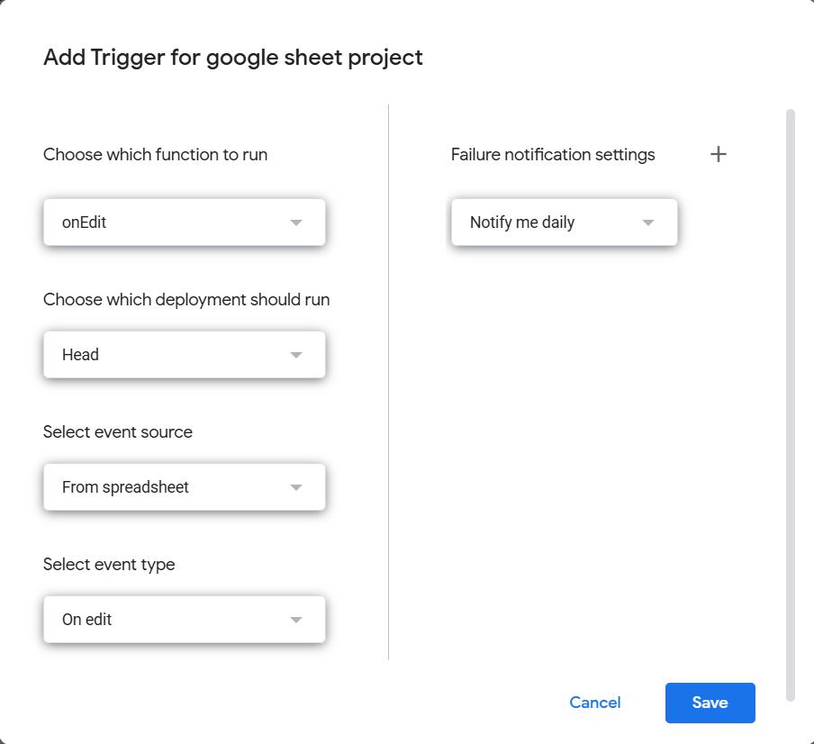

8.  **Save the project** again.

### Step 5: Initialize and Use the App!

You're all set! Go back to your Google Sheet.

1.  **Refresh the Page**: Refresh the browser tab containing your Google Sheet.
2.  **Find the Custom Menu**: A new menu named **"Review Vocabulary"** should appear at the top.
    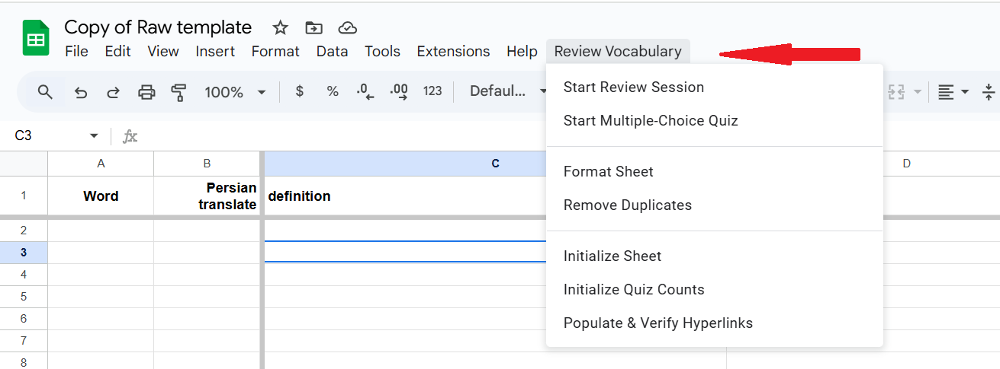
3.  **Initialize Your Sheet (One-Time Actions)**:
    * Click **Review Vocabulary** > **Initialize Sheet**. This sets up the column names. If you have copied the sheet from the template, you probably have column names in advance.
4.  **Start Learning!**:
    * Type a new word in an empty cell in the "Word" column and press Enter. The script will automatically run and fill in the details. It takes several seconds to fill all the cells of that row!
    * Use the **Review Vocabulary** menu to start a review session, take a quiz, or format your sheet.

Enjoy your new AI-powered vocabulary builder!

---

In some cases, you might need to do the following:
1. Go to `Projecct Settings`, and enable `Show "appsscript.json" manifest file in editor` option.
2. Return to the editor. Now, you should see another file named `appsscript.json`.
3. Modify its content in this way:
    ```
    {
    "timeZone": "Asia/Tehran",
    "dependencies": {
        "enabledAdvancedServices": [
        {
            "userSymbol": "Sheets",
            "version": "v4",
            "serviceId": "sheets"
        }
        ]
    },
    "oauthScopes": [
        "https://www.googleapis.com/auth/script.external_request",
        "https://www.googleapis.com/auth/script.container.ui",
        "https://www.googleapis.com/auth/spreadsheets"
    ],
    "exceptionLogging": "STACKDRIVER",
    "runtimeVersion": "V8"
    }
    ```

---

### Disclaimer

All code in this project (`Code.gs`, `ReviewDialog.html`, `QuizDialog.html`, `ScramblePuzzle.html`) was generated by an AI. It is provided as-is and may require adjustments for specific use cases.

